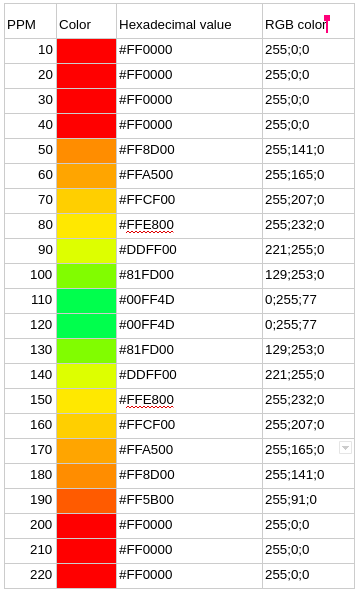

# DON'T DIE NOW AND RUN

This project was made as part of an IOT course at the ESGI school, during quarantine.

## :checkered_flag: Project and goals

We decided to create a connected bracelet to use during a sporting activity in order to control the heart rate.

The primary objective is security: unlike the various connected watches and bracelets that do many things, we put aside other features and design in order to be able to alert the user very visibly of a potential danger.

The bracelet has several LEDs changing color depending on the user's heartbeat: from green for a normal beat to red for an alarming beat. If the heartbeat sounds alarming based on the user's age, an alarm will sound. The user can press a button to stop the alarm.

A mobile application allows the user to create an account and enter its age. It also allows to view reports on the cardiac activity.

## :rainbow: Design 

We have chosen two push buttons and indicative texts of fairly large sizes to facilitate use and optimize ergonomics.
The LEDs are arranged over the entire surface of the bracelet in order to give a very visual account of cardiac activity.

## :wrench: Technical requirements

### Hardware
#### IOT

|        Component        | Quantity |   Reference    |
| ----------------------- | -------- | -------------  |
| Arduino Uno             | 1        | R3             |
| Bande 8 NeoPixels       | 2        | WS2812 5050    |
| Piezoelectric speaker   | 2        | Murata 7BB-12-9|
| Push button             | 2        |                |
| Bluetooth card          | 1        | HC-05          |
| Pulse sensor            | 1        | XD-58C         |

#### Smartphone

* **Android**: minimum SDK version 16, target 28
* **Apple**: iOS 8.0

### Software
#### IOT
The IOT software was developed and tested in the TinkerCad editor.
All the code is available in this repository, folder `enter folder name here`.
#### Smartphone
The mobile application is available on Apple and IOS. It was developed with Flutter.
All the code is available in this repository, folder `app`.

## :art: TinkerCad modeling
The TinkerCad modeling can be accessed on this [link](https://www.tinkercad.com/things/jK6SQg8SGpy-smashing-jarv/editel?sharecode=iQTb7cqvDhjBPXpZf3uuodtSexlGJFPdbsY2lHX28s8).

## :fuelpump: How it works

### Values and calculations
#### Color variation
The colors of the bracelet depend on the user's PPM.
Here is the color range that we have set up:

#### Alarm
The alarm is triggered when the PPM are deemed dangerous for the user, depending on their age.
We used the Haskell & Fox calculation (1970) : there is a little imprecision with this model but we also do not need a very precise result in our use case. In addition, the formula is not very complex and this facilitates implementation.
A push button can be pressed to stop the alarm.

### Arduino code explanation
The code is fully commented for better comprehension! Check it in the folder `insert arduino code folder` of this repository.

## :arrows_clockwise: Usage

1. **Setup the connected object** according to the TinkerCad modeling
2. **Turn on the connected object** by pressing the first push button (on/off)
3. **Register** with an username, a password and your date of birth
4. **Sign in** with the username and password previously filled
5. **Activate bluetooth on the smartphone**
6. **Pair with the connected object**
7. You can now use your bracelet while doing sporting activities and view reports on your smartphone!

